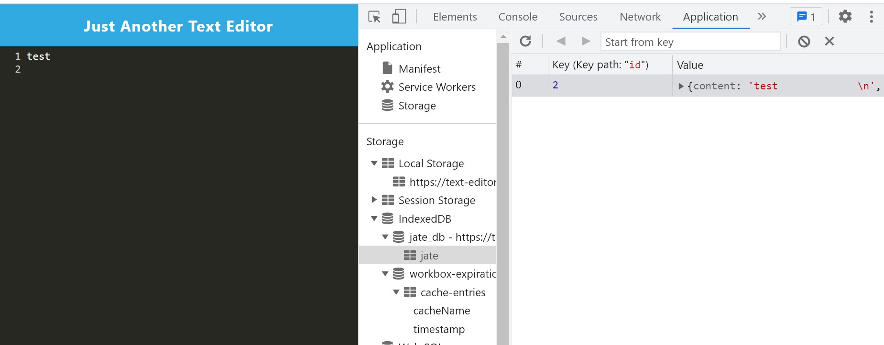
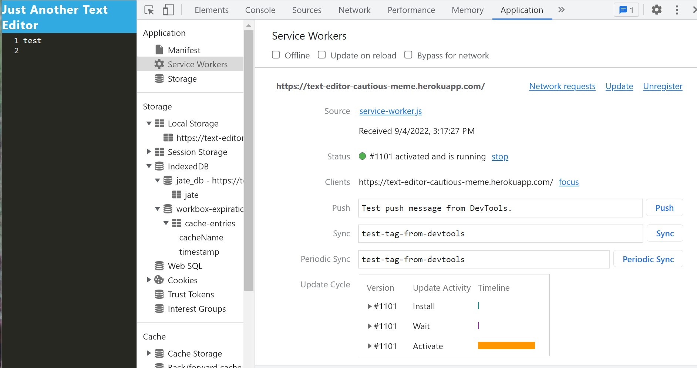
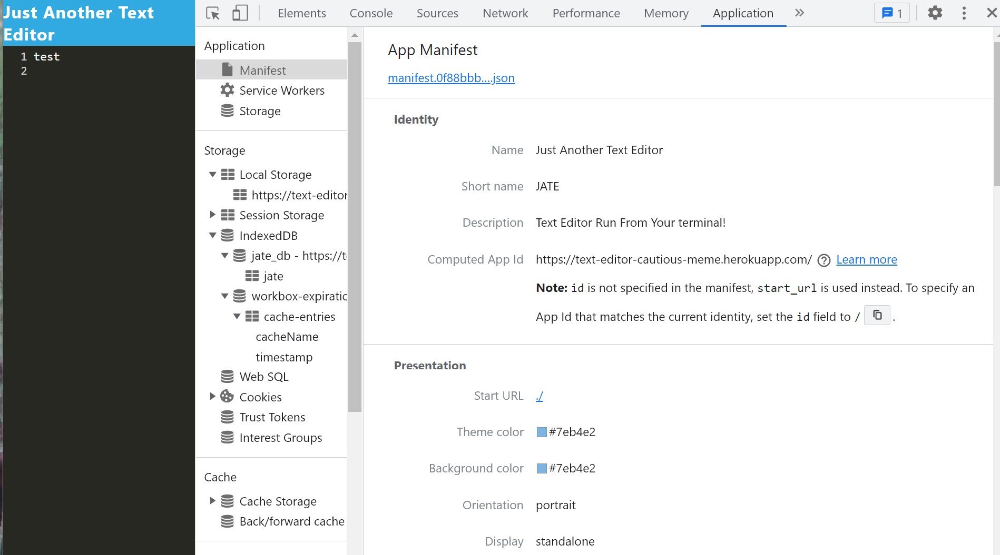
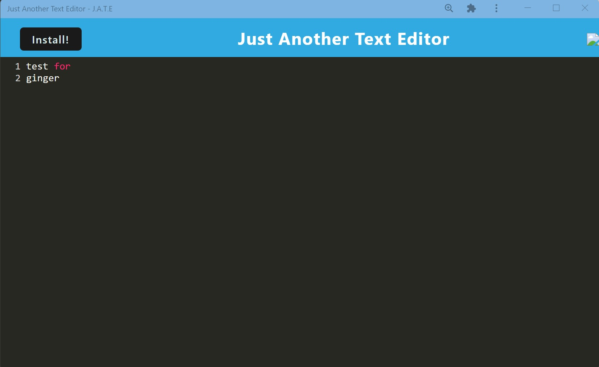

# Text Editor

## This is a text editor that runs in your browser for a user to write and save notes or code snips so they can work online or off. The app is located on Heroku at [https://text-editor-cautious-meme.herokuapp.com/](https://text-editor-cautious-meme.herokuapp.com/).

## Table of Contents:

- [Installation](#installation)
- [Usage](#usage)
- [Screenshots](#screenshots)
- [License](#license)
- [Collaborators](#collaborators)
- [Contributing](#contributing)
- [Testing](#tests)
- [Questions](#questions)

## Installation

Clone the repository from [GitHub](https://github.com/willig0203/text-editor-cautious-meme) onto your machine in a local folder if you want to run it locally.

## Usage

Step one: From the terminal in vsCode type `npm install` in client, server and root folders.
Step two: Enter `npm start` in the root directory to start the server and the client.
Step three: Enter localhost:3001 in your browser.
Step 4: You can install the app on your device by selecting install button.

OR

Use the live app on Heroku: [https://text-editor-cautious-meme.herokuapp.com/](https://text-editor-cautious-meme.herokuapp.com/)

## Screenshots

|       <b>Image running in a web browser</b>       |
| :-----------------------------------------------: |
|  |

|                 <b>Image service worker</b>                 |
| :---------------------------------------------------------: |
|  |

|                 <b>Image manifest</b>                  |
| :----------------------------------------------------: |
|  |

|              <b>Image installed as pwa</b>              |
| :-----------------------------------------------------: |
|  |

## License

&copy; 2022 by Gary Williams (Trademark GarywareLLC).
This project is licensed under the MIT license.
https://opensource.org/licenses/MIT

## Collaborators:

Gary Williams

## Contributing

None at this time.

## Tests

None at this time.

## Questions

Contact Gary Williams at: [willig0203@gmail.com](mailto:willig0203@gmail.com)
